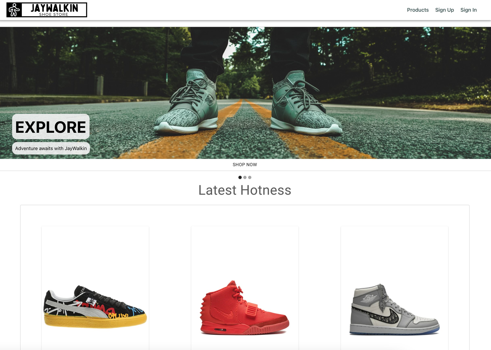
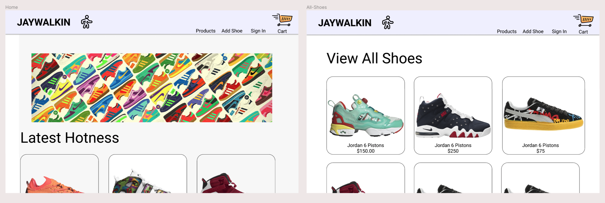
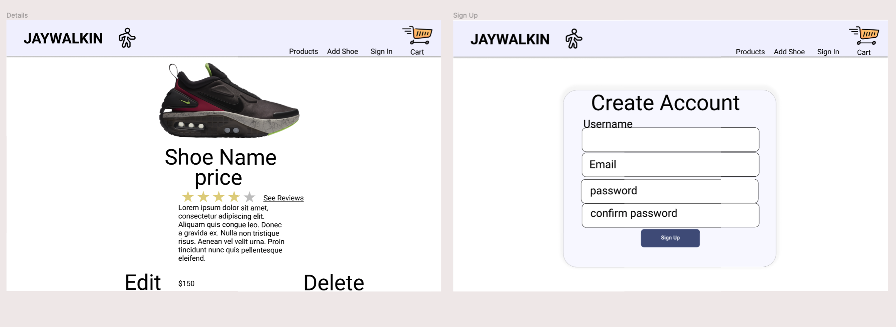
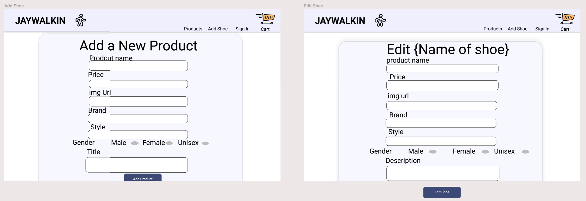
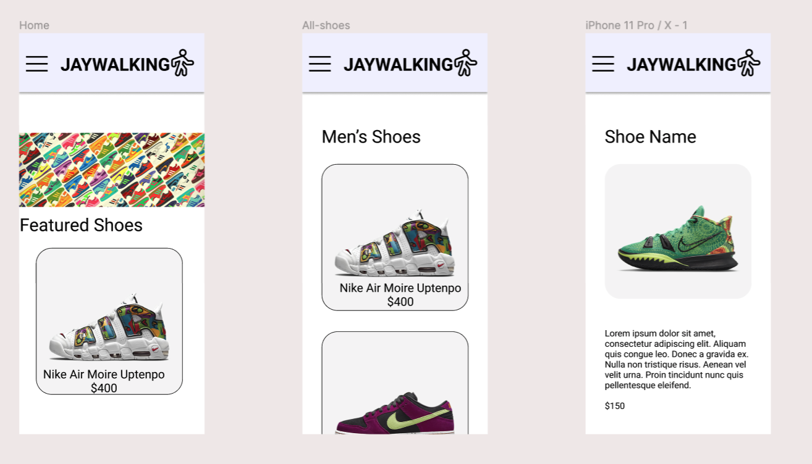
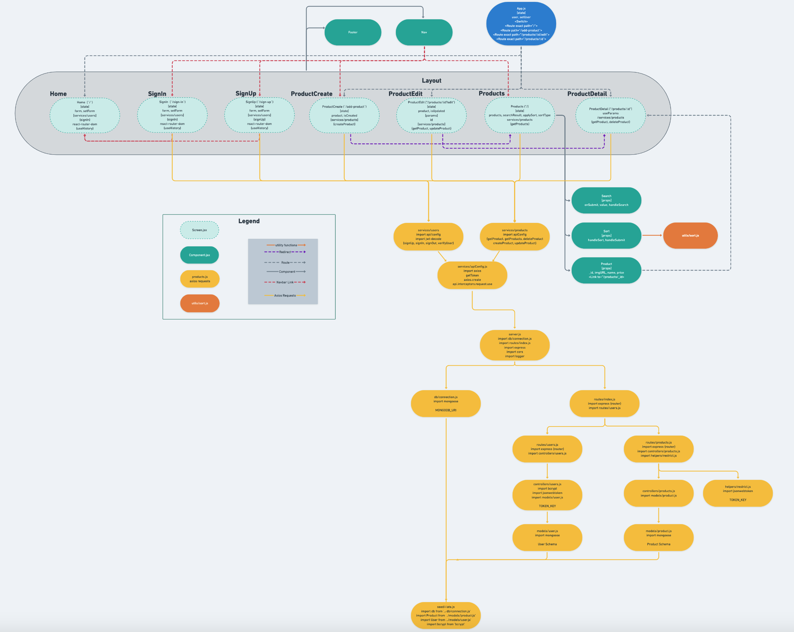

# JayWalkin Shoe Store


### JayWalkin Website Link

[Deployed Site](https://jaywalkin.netlify.app/ "JayWalkin")

### Overview

- JayWalkin(v1) is an app that has a collection of mid-to-high range sneakers.
- Users can create a new account or login to an existing account.
- Once logged in, users(admin) can add, edit, view, and delete sneakers in the database.
- Users(admin) can view individual sneaker details and price.
- This app is built for desktop, and also responsive for mobile viewing.

### Developement Team

- Jason Moritz:
  [LinkedIn](https://www.linkedin.com/in/jason-moritz/ "LinkedIn") / [Personal GitHub](https://github.com/jason-moritz "GitHub")
- Nathan Lyle:
  [LinkedIn](https://www.linkedin.com/in/thenathanlyle/ "LinkedIn") / [Personal GitHub](https://github.com/thenathanlyle "GitHub")
- Monsoud Zanaty:
  [LinkedIn](https://www.linkedin.com/in/monsoud-zanaty-93559b212/ "LinkedIn") / [Personal GitHub](https://github.com/Arsenalfutbol14 "GitHub")
- Diego Gallardo:
  [LinkedIn](https://www.linkedin.com/in/digallardox/ "LinkedIn") / [Personal GitHub](https://github.com/digallardox "GitHub")



### Schema

```
const User = new Schema(
    {
        username: { type: String, required: true},
        email: { type: String, required: true },
        password_digest: { type: String, required: true, select: false}
    },
    { timestamps: true }
)

const Product = new Schema(
    {
        name: { type: String, required: true },
        imgURL: { type: String, required: true },
        description: { type: String, required: true },
        price: { type: String, required: true },
        category: { type: String, required: true },
        brand: { type: String, required: true },
        gender: { type: String, required: true }
    },
    { timestamps: true }
)
```

### Wireframe

[Figma Wireframe](https://www.figma.com/file/2NY44sAcIFmyEBs2GsnJor/P3-Design?node-id=0%3A1 "Figma Wireframe")





### Component Hierarchy

[Whimsical Component Hierarchy](https://whimsical.com/p3-wireframe-Gx1WsQdGdUDaQg1vxJ24S6 "Whimsical Component Hierarchy")


### Deployed Backend via Heroku

[Heroku](https://jay-walkin.herokuapp.com/api/products "Heroku")

### Github Projectboard

[Projectboard](https://github.com/lukewarmsoup1486/jay-walkin/projects/1 "Github Projectboard")

### GoogleDoc

[GoogleDoc](https://docs.google.com/document/d/1ET4LXk-h7n-fF6JBBxY-D7EQz-DFZX7gP3gyseQJXEw/edit?usp=sharing "GoogleDoc")
